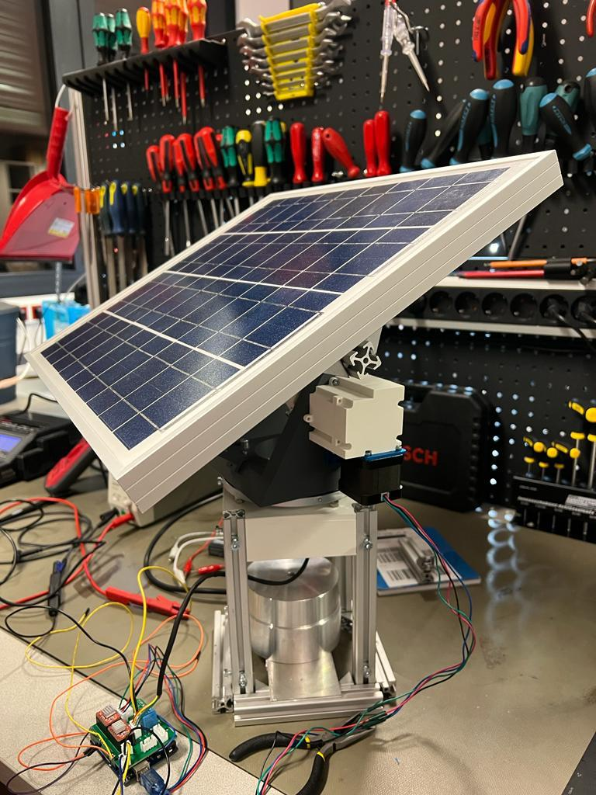
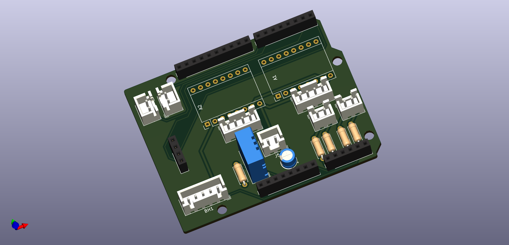

# Dual Axis Solar Tracker PCB

This repository contains the **PCB design and electronics for a mobile IoT-monitored dual-axis solar tracking system**.

The system automatically aligns a photovoltaic panel with the position of the sun to maximize solar energy generation.

The project combines **mechanical design, embedded systems, PCB development, and IoT communication**.

---

# 📄 Paper

The full project description is available in the paper:

➡️ **[Read the Paper](EMS-Gruppe%2016_STRZYZEWSKI_GAJIC_EL-Harery.pdf)**

---

# 🛰 Solar Tracker System

The system uses an **Arduino Uno WiFi Rev2** to calculate the sun position based on GPS data and automatically align the photovoltaic panel using two motorized axes:

- **Azimuth rotation**
- **Altitude rotation**

The tracker communicates with an **IoT platform via WiFi using MQTT**.

---

# 🔌 PCB Design

The project includes a custom **Arduino Shield PCB** which integrates:

- Stepper motor control
- Sensor interfaces (light, temperature, GPS)
- Power management
- Communication interfaces

---

# ⚙️ System Architecture

The solar tracker consists of three main subsystems:

### Embedded Control

- Arduino Uno WiFi Rev2
- Sun position calculation via library
- Stepper motor control
- Sensor data acquisition

### Electronics

Custom PCB providing:

- Motor driver interfaces
- Sensor connections
- GPS interface
- Power distribution

### Mechanical System

- **3D printed planetary gearbox** for altitude motion
- **Worm gear transmission** for azimuth motion
- Mobile solar platform

---

# 🌐 IoT Monitoring

System data is transmitted to an IoT platform via **WiFi using MQTT**.

Monitored parameters include:

- GPS position
- Solar panel orientation
- Illumination data
- Temperature
- System status

---

# 🔋 Power System

The system is powered by a **3S Li-Po battery (11.1V)** which is charged by the photovoltaic panel.

---

# 👨‍🔬 Authors  
Karim El-Harery  
